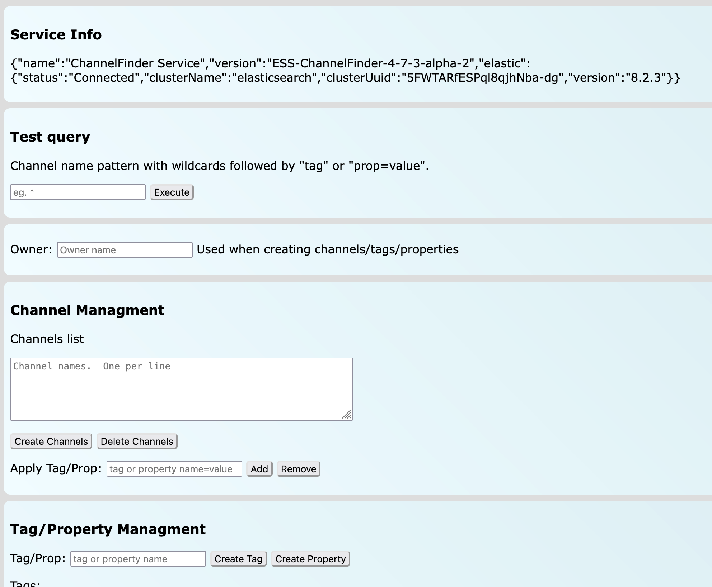

# Operator guide
You can find Channel finder in interfaces of other EPICS apps: Phoebus, PVinfo, apps developed by your organizastion or via open api. There are examples:
### Phoebus
TODO add pic
### PVinfo
TODO add pic

## Web view:


In every case where you'll find it, CahnnelFinder will behave very similary, so the usage is very similar as well for every case.

Query Example:

All PVs from the insertion device 31:
```
	XF:31*IDA*
```
All PVs from the insertion device 31 belonging to axis 4:
```
	XF:31*IDA*&axis=4*
```
All PVs from the insertion device 31 belonging to axis 4 and with pvStatus active:
```
	XF:31*IDA*&axis=4*&pvStatus=active
```
All PVs from the insertion device 31 belonging to axis 4 with tag sys.XF:31:
```
	XF:31*IDA*&axis=4*&~tag=aphla.sys.SR
```
